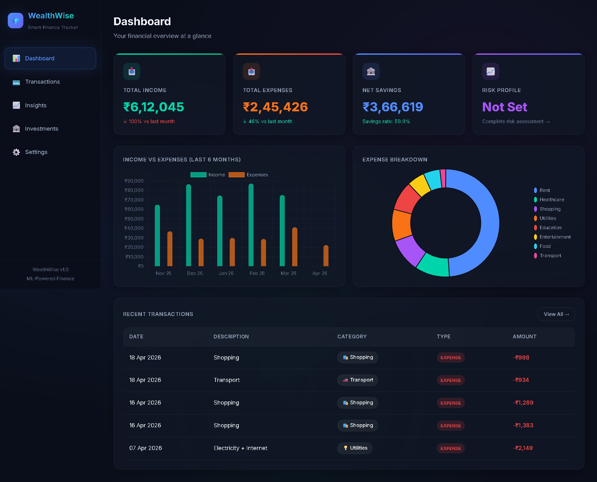
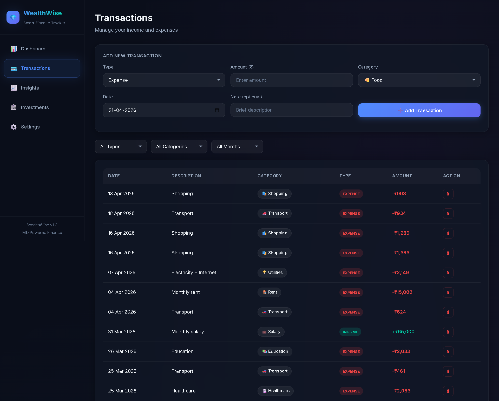
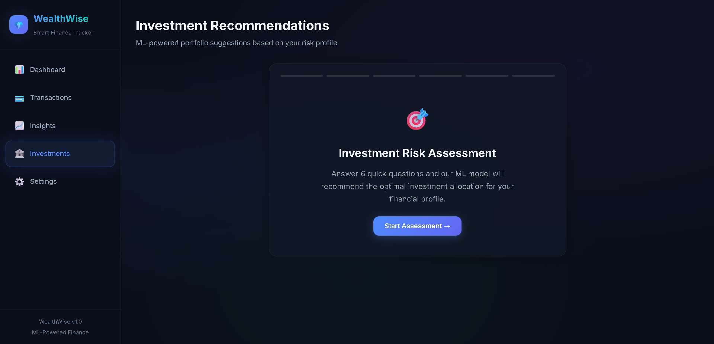
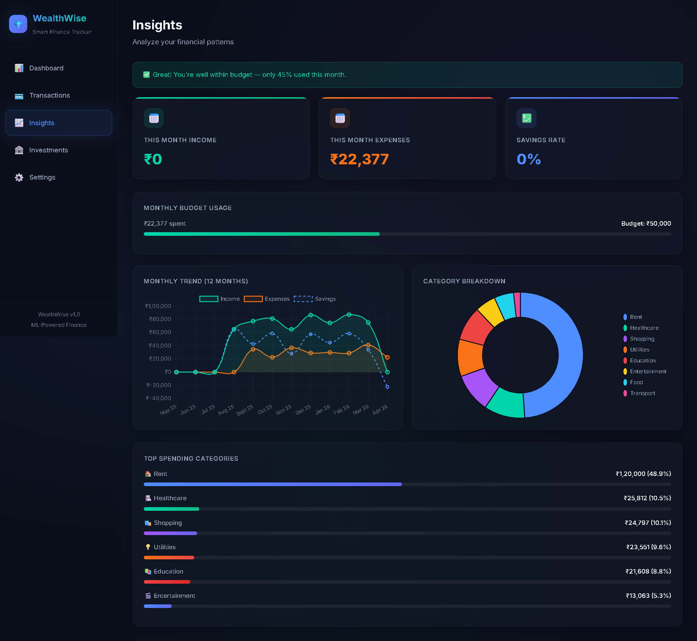

# 🏦 WealthWise — Personal Finance & Investment Recommendation System

A full-stack web application that combines a **personal finance tracker** with an **ML-powered investment recommendation engine**. Track your income, expenses, and get personalized portfolio suggestions based on your risk profile and actual financial health.

---

## ✨ Features

### 📊 Dashboard
- Summary cards showing Total Income, Expenses, Net Savings, and Risk Profile
- 6-month Income vs Expenses bar chart
- Expense breakdown donut chart
- Recent transactions table
- Budget alert notifications (80%/100% thresholds)

### 💳 Transaction Management
- Add income and expense transactions with categories, amounts, dates, and notes
- 13 categories (Food, Rent, Transport, Entertainment, Shopping, Healthcare, Education, Utilities, Salary, Freelance, etc.)
- Filter by type, category, and month
- Delete transactions
- All data persisted in browser LocalStorage

### 📈 Insights & Analytics
- 12-month income/expense/savings trend chart
- Category breakdown donut chart
- Monthly budget progress tracking
- Top spending categories with progress bars

### 🏦 Investment Recommendations
- 6-step risk profiling quiz (age, income, horizon, risk tolerance, knowledge, goals)
- ML model prediction → 4 profiles: Conservative / Balanced / Growth / Aggressive
- **Financial Health Check** — analyzes actual transaction data to:
  - Calculate savings rate, expense-to-income ratio, emergency fund months
  - Show investable amount per month
  - Warn if expenses exceed income (recommends saving first before investing)
  - Dynamically adjust investment recommendations based on financial health
- Portfolio allocation pie chart with investment cards
- Model confidence meter

### ⚙️ Settings
- Set monthly budget limit
- Export transactions as CSV
- Load sample data for demo
- Reset all data

---

## 🛠️ Tech Stack

| Component | Technology |
|-----------|-----------|
| Frontend | HTML5, CSS3 (Vanilla), JavaScript (ES6+) |
| Charts | Chart.js 4.4.4 (CDN) |
| Storage | Browser LocalStorage |
| Typography | Google Fonts (Inter) |
| ML Pipeline | Python, scikit-learn, XGBoost |
| Visualization | Matplotlib, Seaborn |
| Notebook | Jupyter Notebook (.ipynb) |

---

## 📁 Project Structure

```
WealthWise/
├── index.html                              # Main SPA entry point
├── README.md                               # This file
├── css/
│   └── style.css                           # Complete design system (dark theme + glassmorphism)
├── js/
│   ├── app.js                              # SPA router, storage, utilities
│   ├── transactions.js                     # Transaction CRUD + filtering
│   ├── dashboard.js                        # Summary cards + charts
│   ├── insights.js                         # Analytics + budget tracking
│   ├── investments.js                      # Risk quiz + financial health + recommendations
│   └── model-rules.js                      # ML decision rules (exported from notebook)
└── notebook/
    └── investment_recommendation_model.ipynb  # Full ML pipeline
```

---

## 🚀 Getting Started

### Web App
1. Clone or download this repository
2. Open `index.html` in any modern browser
3. Go to **Settings → Load Samples** to populate demo data
4. Explore Dashboard, Transactions, Insights, and Investments views

### ML Notebook
1. Open `notebook/investment_recommendation_model.ipynb` in Jupyter Notebook or Google Colab
2. Install required packages:
   ```bash
   pip install scikit-learn xgboost pandas numpy matplotlib seaborn
   ```
3. Run all cells to train models and see results

---

## 🤖 ML Pipeline Overview

The Jupyter notebook implements a complete classification pipeline:

1. **Synthetic Data Generation** — 5,000 user financial profiles with 10+ features
2. **EDA** — Feature distributions, class balance, correlation analysis
3. **Base Models** — Logistic Regression, Decision Tree, Random Forest, XGBoost, SVM, KNN
4. **Ensemble Learning** — Voting (Hard/Soft), Stacking, Bagging classifiers
5. **Hyperparameter Tuning** — GridSearchCV + RandomizedSearchCV
6. **Cross-Domain Generalization** — Tested across age, income, and geographic segments
7. **Model Export** — Decision rules exported to `model-rules.js` for browser-based inference

### Results

| Metric | Value |
|--------|-------|
| Final Ensemble Accuracy | **76.3%** |
| ROC-AUC | **0.929** |
| Tuned RF Improvement | +2.1% |
| Tuned XGBoost Improvement | +2.3% |

---

## 💡 How the Financial Health Check Works

The investment recommendation engine doesn't just rely on quiz answers — it also analyzes your **real transaction data**:

- **Savings Rate < 0%** → Profile strongly downgraded, advises saving before investing
- **Savings Rate < 10%** → Profile moderately downgraded toward safer investments
- **No Emergency Fund** → Warning to build 3-month expense buffer first
- **High Expense Ratio (>80%)** → Suggestion to reduce discretionary spending
- **Healthy Finances (>35% savings, 6+ months emergency)** → Small upgrade possible

This ensures recommendations are grounded in reality — if someone has no savings and high expenses, the system tells them to **save first** rather than suggesting aggressive stock investments.

---

## 📸 Screenshots

### Dashboard


### Transactions


### Investment Quiz


### Insights


---

## ⚠️ Disclaimer

Investment recommendations are for **educational purposes only**. Past performance does not guarantee future results. Please consult a certified financial advisor before making investment decisions.

---

## 📄 License

This project is built for educational and portfolio purposes.
